# 🎓 PostClasses Website - Amay W

Welcome to **PostClasses**, a simple and minimal after-classes management website! This project allows users to explore various after-school activities like Chess, Public Speaking, Cooking, and more. Users can **add classes to their cart**, **proceed to checkout**, and **submit their details**, which are seamlessly stored in **MongoDB** using **Render** as the web service.

---

## 📌 Links to Project Resources

- **GitHub Pages Link**: [Click me to watch live👆](https://amay-w.github.io/postclasses_frontend/)
- **GitHub Repo (Frontend)**: [Frontend Repository](https://github.com/Amay-W/postclasses_frontend)
- **GitHub Repo (Backend)**: [Backend Repository](https://github.com/Amay-W/postclasses_backend)
- **Live Render Deployment for Subjects**: [All Lessons](https://postclasses-backend.onrender.com/collection/lessons)
- **Live Render Deployment for Orders** [All Orders](https://postclasses-backend.onrender.com/collection/orders)

---

## 📽️ Demonstration Video

Below is a video demonstrating all features of the PostClasses website, from browsing classes to completing the checkout process.

<video width="100%" height="auto" controls>
  <source src="readmeAssets/demo_video.mp4" type="video/mp4">
  
</video>

---

## 🖥️ Project Overview

The **PostClasses** website is built with:
- **Frontend**: HTML, CSS, JavaScript
- **Backend**: Node.js (Express) with MongoDB as the database
- **Web Service**: Render for hosting the backend
- **Database**: MongoDB for storing class and order details

### Key Features:
1. **Browse Classes**:
   - View a selection of after-school classes with details like:
     - Title  
     - Description  
     - Location  
     - Price  
     - Seats available  
     - Ratings  

   ****:  
   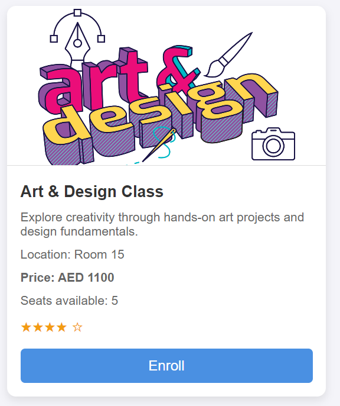

2. **Search and Filter**:
   - **Search** by:
     - Title  
     - Description  
     - Location  
   - **Filter** classes by:
     - Subject  
     - Location  
     - Availability  
     - Price  

    
   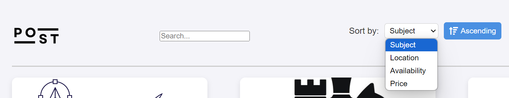

3. **Add to Cart**:
   - Users can select multiple classes and add them to their cart.  
   **Image**:  
   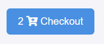

4. **Checkout**:
   - At the checkout page, users can:
     - **Remove items** from the cart  
     - **Submit** their order by entering their **name** and **phone number**.  

   **Image**:  
   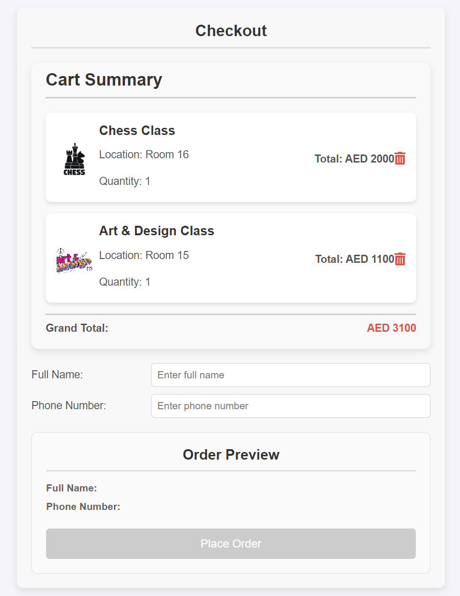

5. **Data Storage**:
   - Upon submission, order details are sent to the backend and stored in MongoDB.

---

## 🚀 Technical Details

### Frontend

The frontend repo includes:
- `index.html`: Main webpage structure
- `styles/style.css`: Custom styling for the website
- `javascripts/classes.js`: This script was intially used as class data. Now the data comes directly from MongoDB.

### Backend

The backend repo contains:
- `server.js`: Handles API routes for GET, POST, PUT, and Search operations.
- `package.json`: Project dependencies.

---

## 🔧 API Endpoints (Postman Screenshots)

The backend exposes the following RESTful APIs:

1. **GET LESSONS** `/collection/lessons`  
   Fetch all available classes.  
   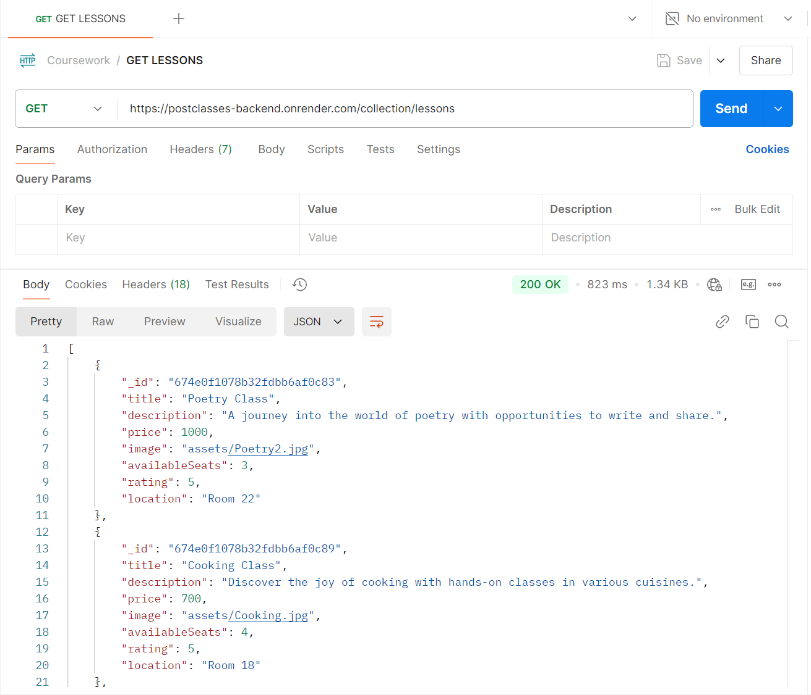

2. **POST ORDERS** `/collection/orders`  
   Submit user order details (name, phone, and selected classes).  
   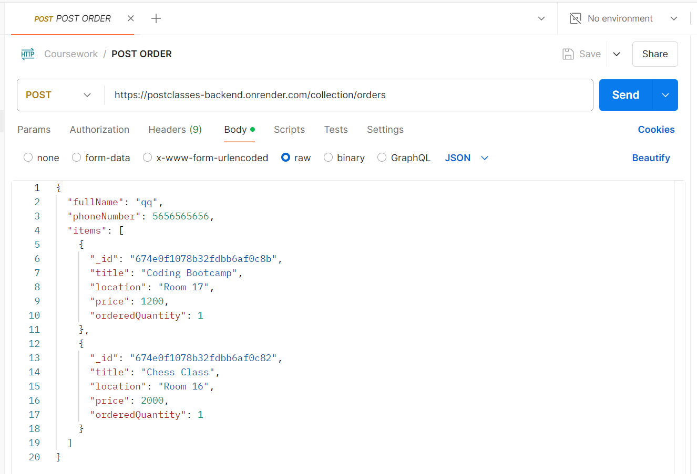

3. **PUT LESSONS** `/collection/lessons/674e0f1078b32fdbb6af0c83`  
   Update class details (like seats available).  
   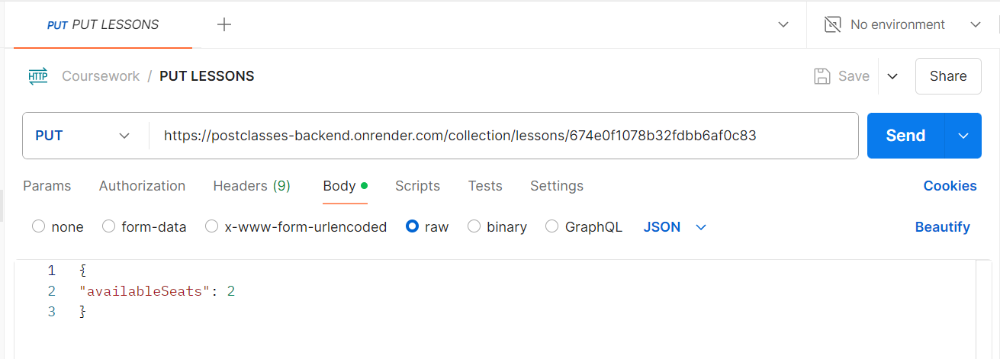

4. **SEARCH LESSONS** `search/lessons?q=Poetry`  
   Search a lesson, desciption, location by query.  
   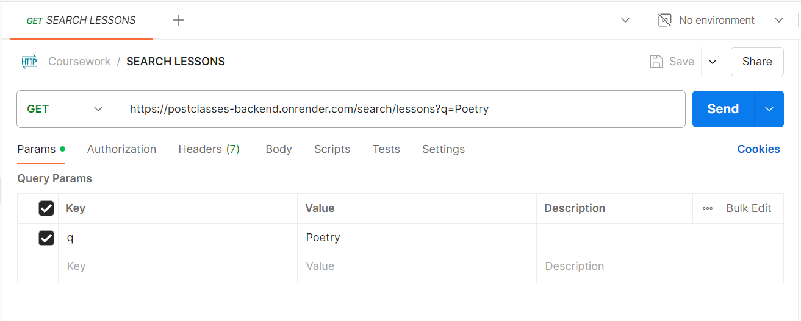

---

## 🗄️ MongoDB Collections

Data is stored in the following collections:
- **Lessons**: Stores information about the available classes.  
   Example document:  
   ```json
   {
       "title": "Chess Class",
       "description": "Master strategic thinking in our chess sessions for beginners and experts.",
       "location": "Room 16",
       "price": 2000,
       "seats_available": 5,
       "rating": 4.5
   }

- **Orders**: Captures user details and the classes they enrolled in. 
   Example document: 
   ```json
   {
    "name": "John Doe",
    "phone": "1234567890",
    "classes": [
        { "title": "Chess Class", "quantity": 2 },
        { "title": "Coding Bootcamp", "quantity": 1 }
    ],
    "total": 6000
   }

- **MongoDB Screenshots**:  
   **Lessons**: 
   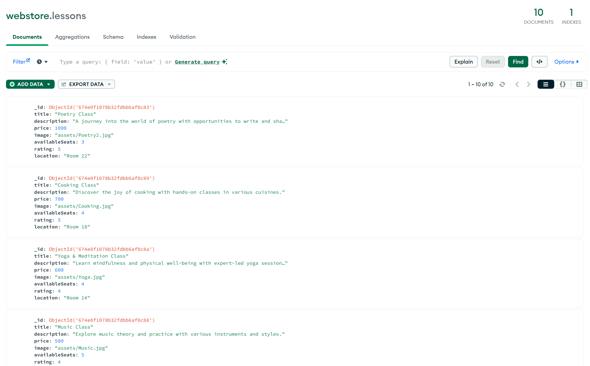
   **Orders**: 
   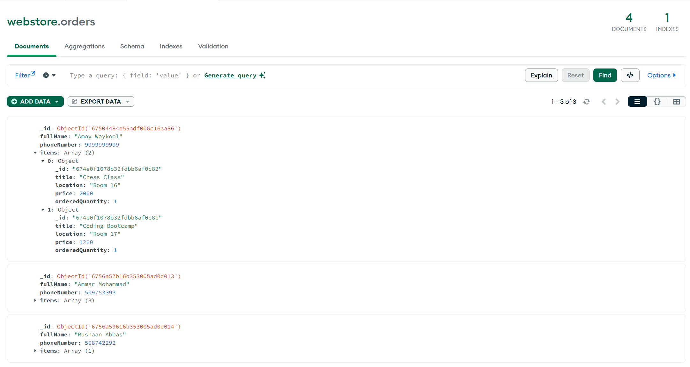

---

## 🌐 Render Deployment
The backend is deployed using Render. Here’s a snapshot of the live deployment configuration:
   ****: 
   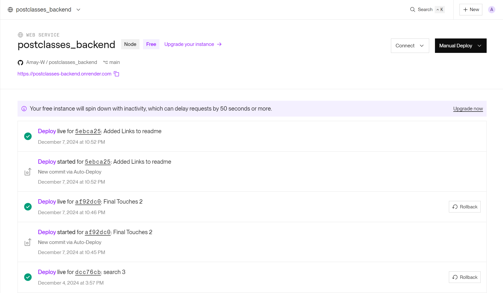

---

## 🧩 Future Improvements
- Add user authentication for managing accounts.
- Implement email confirmations for successful orders.
- Integrate a payment gateway for seamless transactions.
- Optimize backend performance for larger datasets.


 
